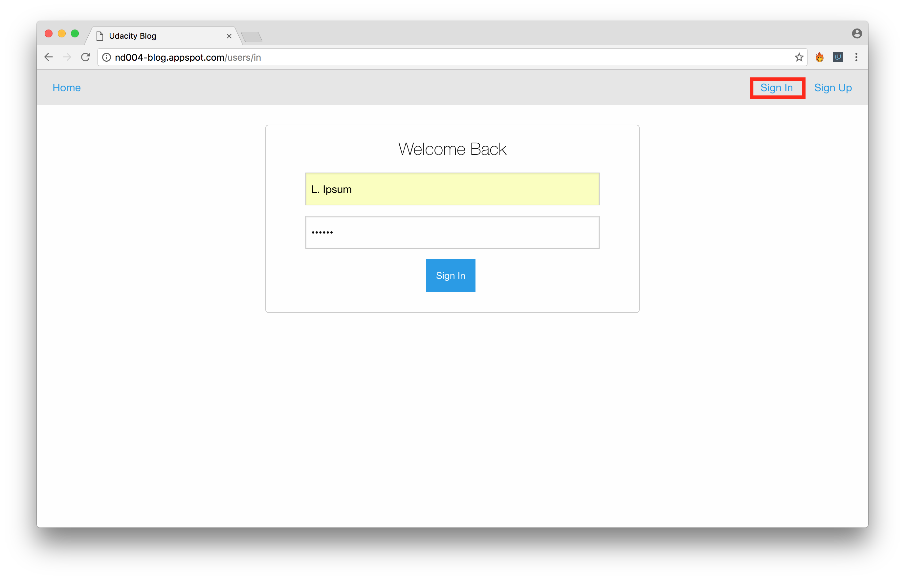

# Overview
This project implements a multi-user blog using Google App Engine. Users are able to sign up for accounts; contribute posts; and add comments to blog posts. Additionally, all submitted content (i.e. posts and comments) can be edited or deleted.

# Accessing The Project

The project is hosted at [http://nd004-blog.appspot.com](http://nd004-blog.appspot.com). You'll know you're in the right place when you see this page:

# Functionality and Usage

## Accounts

### Signing Up

New users can sign up for an account via the Sign Up page

Note that new users must propose a unique username, and that both a username and password must be supplied

### Signing In

Existing users can log in via the Sign In page, which is accessed via the 'Sign In' link. This link is only visible to visitors that are not signed in.

Note that invalid credentials will cause a validation error. (For the sake of security, the data that triggered the validation error is not indicated).

When users sign in, they receive a warm greeting

### Signing Out

Only signed in users have the option to sign out; users sign out by clicking the 'Sign Out' link.

## Posts

The primary entity in a blog are posts: posts can be read by anyone, but may only be created, edited, and deleted by specific users.

Signed in users can 'Like' a post, which elevates the position of the post on the main page.

### Create

Any signed in user can create a post by clicking the 'New Post' link. This will direct them to a form for creating new posts.

In order to submit a new post, all fields must be filled out, otherwise the page will be re-rendered with validation errors.

### Read

Any user can see a list of posts on the homepage (accessible via the 'Home' link), and specific posts can be viewed in their entirety by clicking on their title.

Posts are listed in order of popularity, and then by newest.

### Update

If a user is signed in as the author of a given post, they can perform edits on it. The Edit link is only available to users that are authors of a given post.

Clicking the Edit link renders the editing page, which allows user to submit their edit (which is subject to validation) or cancel their edit.

### Delete

If a user is signed in as the author of a given page, they are also able to delete a post by clicking the Delete link. This will permanently remove a post from the blog.

### Like / Unlike

A signed in user who has _not_ authored a given post is eligible to 'Like' that post. Liking a post is carried out by clicking the Like link on the post's page.

Once a page has been 'Liked', a user can revoke that action by clicking 'Unlike'.

Liking posts affects the counter associated with each post, which determines the position of a post on the main page.

## Comments

Every post may be associated with comments about that post. Comments can be added by any signed in user, but only authors of a given comment may edit or delete their comment.

### Create

If a user is signed in, they are eligible to add a comment; otherwise they are prompted to sign in.

A signed in user posts a comment via the comment form.

### Read

Any user can read comments. Comments are displayed in chronological order underneath a post so that they can be read from top to bottom as one continuous conversation.

### Update

A signed in user is given the option to edit their own comments. Users access the edit page for the comments by clicking the Edit link.

The edit page displays a form in the context of the conversation so that users are able to access the post and neighbouring comments from the same page.

The timestamp of edited comments is not affected, so comments continue to appear in order of their creation.

### Delete

A signed in user is given the option to delete their own comments. Users delete a comment by clicking the Delete link

